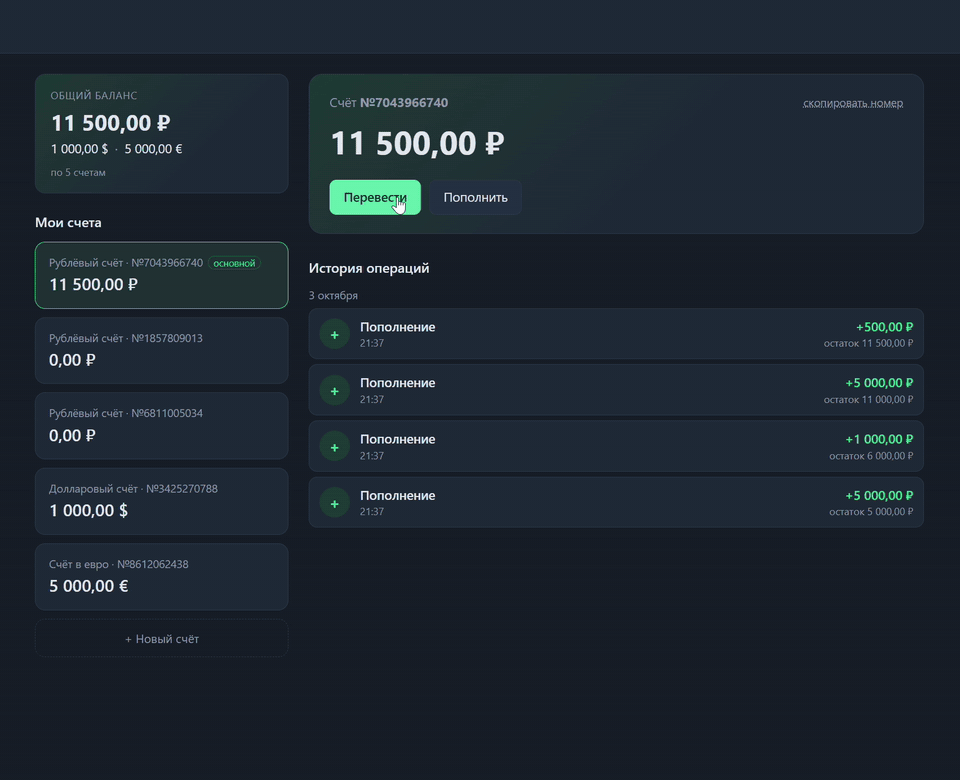
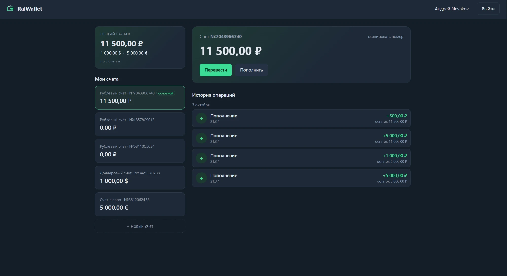
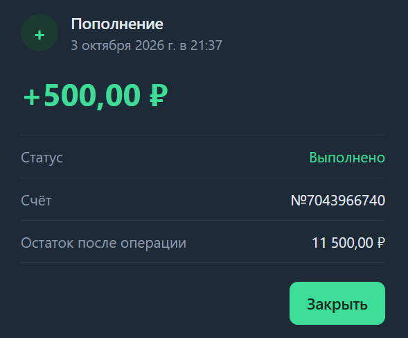
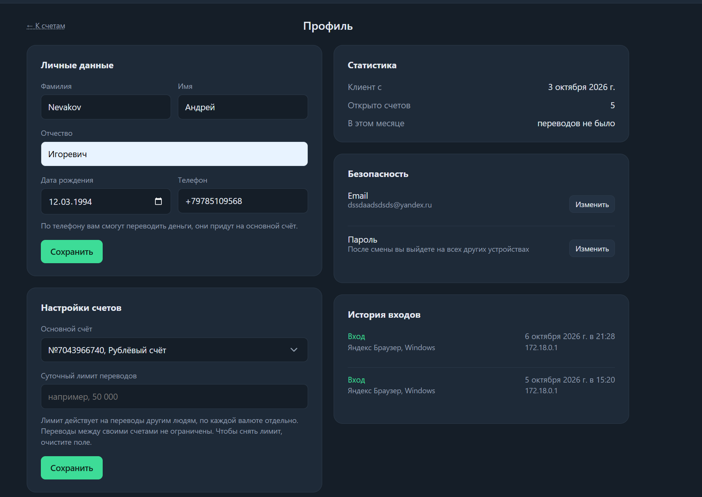
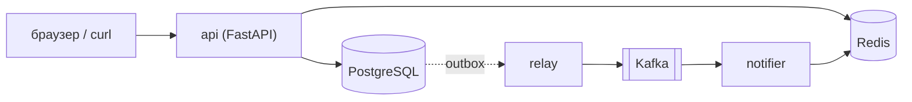
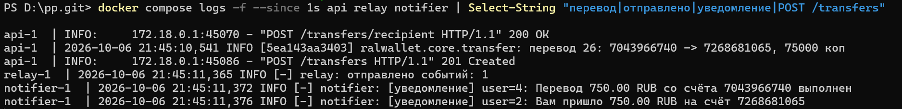
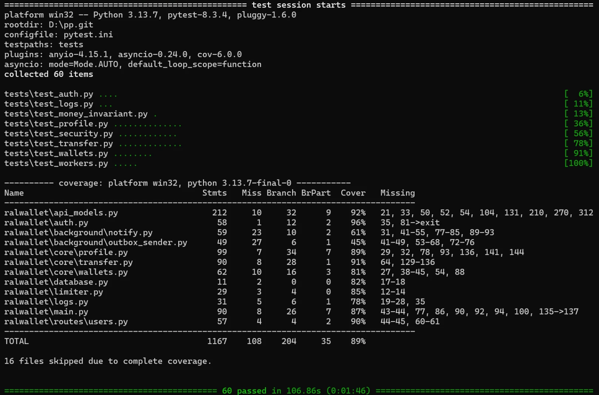

# RalWallet

Сервис кошельков: регистрация, счета в рублях, долларах и евро, переводы по номеру счёта или телефону и история операций. Проект учебный. Хотелось на живом примере разобраться, что может пойти не так с деньгами: два перевода с одного счёта одновременно и денег не хватает на оба, человек нажал «перевести» дважды из-за плохой связи, перевод прошёл, а уведомление о нём так и не отправилось.

Есть веб-интерфейс, но главное тут бэкенд.



То же видео в нормальном качестве: [docs/demo.mp4](docs/demo.mp4). Перевод по телефону, потом подробности операции и «Повторить перевод».



По клику на операцию в истории открываются подробности, а в профиле личные данные, лимит переводов, статистика и история входов:

<p>
  
  
</p>

## Как это устроено



Перевод делается в одной транзакции: блокируются оба счёта, меняются балансы, пишутся операции в историю и событие в таблицу `outbox`. Отдельный процесс `relay` забирает из неё события и отправляет в Kafka, `notifier` читает их и шлёт уведомления (пока просто пишет в лог). Redis нужен для ограничений частоты запросов, счётчика неудачных входов, отозванных токенов и отсева повторных событий.

Деньги хранятся в копейках целым числом, в API приходят и уходят строкой вроде `"150.50"`. float нигде нет.

Стек: FastAPI, SQLAlchemy 2.0 (async) + asyncpg, Alembic, PostgreSQL, Redis, Kafka (aiokafka), Docker Compose. Тесты на pytest, проверки ruff и mypy.

## Запуск

Нужен Docker. Сначала секрет для подписи токенов, без него api не стартует:

```bash
cp .env.example .env
python -c "import secrets; print(secrets.token_urlsafe(48))"
```

Получившуюся строку вписать в `.env` в `JWT_SECRET=`. Потом:

```bash
docker compose up --build
```

Поднимутся postgres, redis, kafka, api и два воркера. Интерфейс на http://localhost:8080, документация API на http://localhost:8080/docs. Миграции накатываются сами при старте api. Порты открыты только на `127.0.0.1`, с других компьютеров в сети приложение не видно.

У меня на Windows после перезагрузки Docker Desktop иногда не стартует с ошибкой про `.sock` файл. Помогает `wsl --shutdown` и удаление (или переименование) папки `%LOCALAPPDATA%\Docker\run`. К проекту это не относится, но время на это я потратил.

## Структура

`routes` принимают запрос, `core` держит логику и сам решает когда делать commit, `repositories` единственное место где пишутся запросы к базе.

```
ralwallet/
  routes/         http: пользователи, счета, переводы
  core/           логика: вход, счета, переводы, профиль
  repositories/   запросы к postgres
  background/     relay (outbox -> kafka) и notifier
  web/            интерфейс, js без сборки
  tables.py       таблицы
  api_models.py   схемы запросов и ответов
migrations/       alembic
tests/            pytest, база в testcontainers
```

## Переводы

Самое интересное в проекте. Что я делал и на чём спотыкался.

Сначала про одновременные переводы (их ещё называют гонками). Если два перевода с одного счёта идут одновременно, оба могут прочитать баланс 500, оба решить что денег хватает и оба списать. Поэтому счета блокируются через `SELECT ... FOR UPDATE`, и второй перевод ждёт пока первый закончит. Блокируются всегда по возрастанию номера счёта: если перевод A→B лочит сначала A, а встречный B→A сначала B, они будут ждать друг друга вечно (дедлок). Тест `test_counter_transfers_no_deadlock` гоняет 20 встречных переводов разом.

Для пополнения сделал по-другому, через поле `version`: обновление проходит только если версия не поменялась с момента чтения, иначе повтор. Это не обязательно, просто хотел попробовать оба подхода.

Повторы. Клиент обязан прислать заголовок `Idempotency-Key`. Если запрос с тем же ключом пришёл ещё раз, возвращается тот же перевод с кодом 200, деньги второй раз не списываются. Если ключ тот же, а сумма другая, будет 409. Одновременные дубли тоже ловятся: второй ждёт на блокировке счёта, потом ещё раз смотрит ключ и видит уже готовый перевод. На всякий случай на ключ стоит уникальный индекс.

Outbox. Если отправлять событие в Kafka прямо при переводе, можно получить перевод без события (кафка лежала) или событие без перевода (транзакция откатилась). Поэтому событие пишется в базу вместе с переводом, а в кафку его потом отправляет `relay`. Доставка получается «хотя бы один раз», дубли возможны, `notifier` отсекает их по `event_id`.

Вот как один перевод проходит через все три сервиса, от сохранения до уведомлений меньше секунды:



Баг, который поймал тест. Когда добавлял перевод по телефону, функция поиска получателя загружала его счёт в сессию SQLAlchemy ещё до блокировки. После `FOR UPDATE` SQLAlchemy отдавал тот же объект со старым балансом из своего кэша, и при параллельных переводах деньги терялись: у получателя оказывалось 100 вместо 500. Блокировка при этом работала, а считалось от устаревшего значения. Исправил через `populate_existing`. Нашёл это тест на параллельные переводы, обычные тесты бы не увидели. После этого добавил `test_money_invariant.py`: 60 случайных параллельных переводов, и сумма всех денег до и после должна совпасть до копейки.

## Безопасность

Прогонял против запущенного сервиса скрипт с атаками и закрывал то, что проходило. Проверки лежат в `tests/test_security.py`.

- SQL-инъекции не проходят, запросы только через ORM с параметрами.
- Секрет для токенов обязательный и проверяется на длину при старте. Раньше в compose был секрет по умолчанию, и с ним токен любого пользователя подделывался за секунду.
- Выход отзывает токен на сервере, смена пароля отзывает все старые токены.
- Пароль нельзя перебирать: 5 попыток на email за 15 минут и лимит с одного ip. Сначала попытки параллельными запросами проскакивали (из 30 одновременных проверялось 25), пришлось увеличивать счётчик до проверки пароля.
- По времени ответа нельзя понять, зарегистрирован email или нет.
- Строгий CSP: на странице выполняется только свой `app.js`.
- Поиск получателя по телефону ограничен 20 запросами в минуту, иначе можно перебрать номера и собрать базу имён.
- Контейнер работает не от root, база, Redis и Kafka снаружи недоступны.

Токен лежит в localStorage, и если на страницу всё-таки попадёт чужой скрипт, его можно украсть. CSP от этого защищает, но надёжнее был бы httpOnly cookie, этого я не делал. HTTPS тоже нет, для сервера нужен reverse proxy.

## API

| Метод | Путь | Что делает |
|-------|------|------------|
| POST | `/users` | регистрация |
| POST | `/auth/login` | вход, возвращает JWT |
| POST | `/auth/logout` | выход |
| GET, PATCH | `/users/me` | профиль: фио, телефон, основной счёт, суточный лимит |
| POST | `/users/me/password` | смена пароля |
| POST | `/users/me/email` | смена email |
| GET | `/users/me/logins` | история входов |
| GET | `/users/me/stats` | статистика за месяц |
| POST | `/accounts` | открыть счёт (только с 18 лет) |
| GET | `/accounts` | мои счета |
| POST | `/accounts/{id}/deposit` | тестовое пополнение |
| GET | `/accounts/{id}/operations` | история, `?limit=50&before_id=...` |
| POST | `/transfers` | перевод по номеру счёта или телефону, нужен `Idempotency-Key` |
| POST | `/transfers/recipient` | кому уйдут деньги, до отправки |
| GET | `/transfers/{id}` | перевод, видят отправитель и получатель |

Пример перевода:

```bash
curl -X POST localhost:8080/transfers \
  -H "Authorization: Bearer $TOKEN" \
  -H "Idempotency-Key: 5b1f0c9e-3a55-4a8e-9f0e-0d6c2b7a1e11" \
  -H "Content-Type: application/json" \
  -d '{"from_account_id":4821993017,"to_phone":"+79035554433","amount":"150.50"}'
```

## Разработка

```bash
pip install -r requirements-dev.txt
ruff check .
mypy
pytest --cov
```



Тестам нужен Docker: postgres поднимается сам через testcontainers. SQLite тут не подходит, в нём нет `FOR UPDATE`. Если база уже есть (как в CI), её можно указать в `TEST_DATABASE_URL`. Kafka в тестах не нужна, вместо неё заглушка. Сейчас 60 тестов, покрытие около 89%. CI гоняет ruff, mypy, тесты с порогом покрытия 85% и собирает образ.

## Что не работает

- Пополнение ненастоящее, вместо платёжного шлюза заглушка (не больше миллиона за раз, выключается `TEST_DEPOSITS=false`).
- Уведомления никуда не отправляются, только пишутся в лог.
- Обмена валют нет, перевести можно только между счетами в одной валюте.
- Суточный лимит и статистика за месяц считаются по UTC, а не по времени пользователя.
- За докером все запросы приходят с одного ip, поэтому лимиты по ip общие для всех. На сервере за прокси это нужно будет переделать.
- Нет refresh токенов, только access на сутки.
